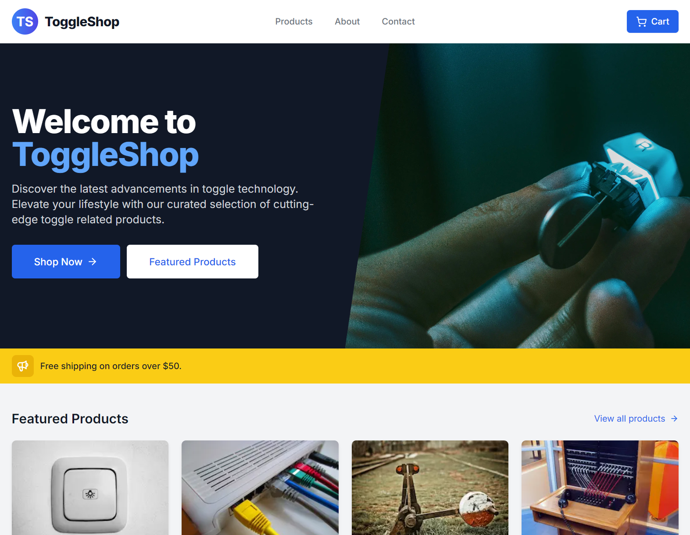
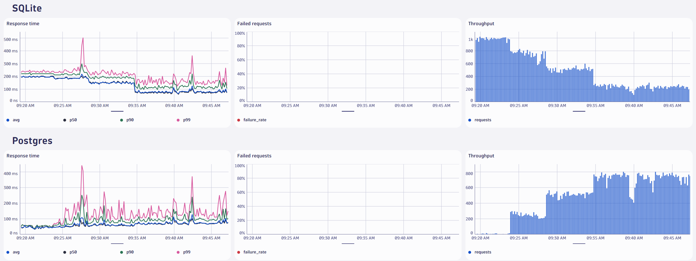

# Welcome to ToggleShop

This is a silly e-commerce demo app called ToggleShop.
The purpose of the demo is to experiment with new OpenFeature functionality in an app that mimics real-world use cases.

## Getting Started

The demo app is completely self-contained but can be configured to send telemetry to an [OTLP](https://opentelemetry.io/docs/specs/otel/protocol/) compatible endpoint.

Follow these steps to get up and running:

1. install dependencies: `npm install`
2. configure OTLP export (optional):
   1. copy env: `cp .env.example .env.local
   2. update `.env.local` with OTLP information
3. start the app: `npm run dev`

Open [http://localhost:3000](http://localhost:3000) with your browser to see the result.

## Feature Flags

ToggleShop leverages a number of feature flags for various technical and business-related use cases.

| Feature Flag        | Type    | Default Variant | Variants    |
| ------------------- | ------- | --------------- | ----------- |
| offer-free-shipping | boolean | true            | true, false |
| use-distributed-db  | boolean | false           | true, false |
| use-secure-protocol | boolean | false           | true, false |

> The flag configuration can be found [here](./flags.json).

### Free Shipping

The `offer-free-shipping` flag controls a banner on the landing page that teases free shipping on orders over $50.
The flag is also used on the checkout page to calculate the total cost.
The purpose of this flag is to demo using a client-side feature flag with the React SDK.
It's also pairs nicely with the event tracking to calculate the business impact.

### Distributed DB

The `use-distributed-db` flag controls which database is used to fetch the list of products.
The databases themselves are mocked for simplicity and have the following characteristics.
The SQLite database offers low latency but do not support concurrent access.
The Postgres database is the inverse.
It offers slightly higher latency but supports concurrent requests.

### Secure Protocol

The `use-secure-protocol` flag is only evaluated when `use-distributed-db` is set to `true`.
It simulates a connection issue with one of the four nodes.

## Scenarios

### Database Migration

The ToggleShop team has noticed that SQLite isn't able to keep up with demand.
To remedy the situation, they've decided to switch to Postgres.
A feature flag is used to ensure a smooth transition.

To simulate the migration yourself, follow these steps:

- configure OTLP export (see getting started)
- start the load generator: `make run-db-migration`
- observe the logs and metrics
- update the `use-distributed-db` flag fractional distribution to be `["true", 25]` and `["false", 75]` in the [flags.json](./flags.json).
- observe the logs and metrics.
- update the `use-distributed-db` flag fractional distribution to be `["true", 50]` and `["false", 50]` in the [flags.json](./flags.json).
- observe the logs and metrics.
- update the `use-distributed-db` flag fractional distribution to be `["true", 75]` and `["false", 25]` in the [flags.json](./flags.json).
- observe the logs and metrics.
- update the `use-distributed-db` flag fractional distribution to be `["true", 100]` and `["false", 0]` in the [flags.json](./flags.json).
- observe the logs and metrics.

If all goes well, you should see the migration complete without any issues.

